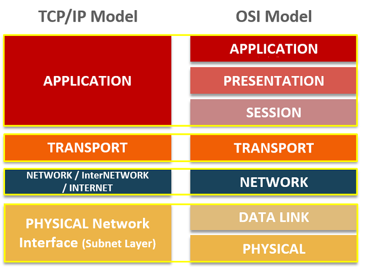
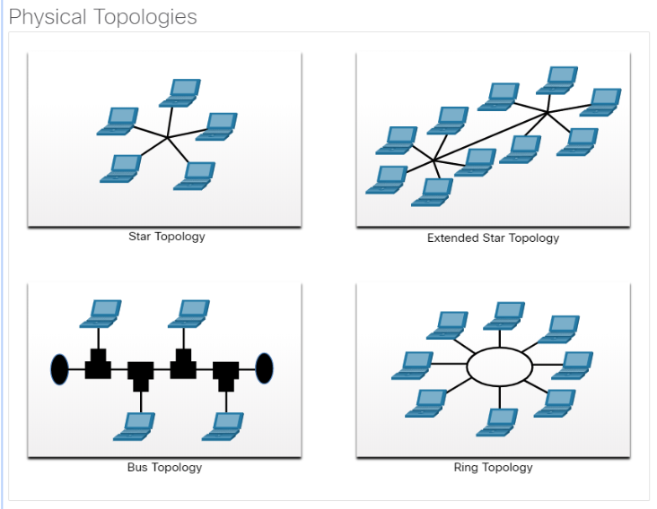
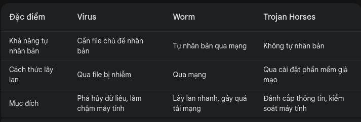

### Keyword
- Reliability: độ tin cậy
- Model layer OSI && TCP/IP:


# Basic concept
- IPV4: 32 bits = 4 bytes
- IPV6: 128 bits = 16 bytes
- Default Gateway: là một thiết bị mạng, thường là một router hoặc switch, mà máy tính hoặc thiết bị sử dụng để gửi dữ liệu đến các mạng khác ngoài mạng cục bộ của nó. Đây là điểm cuối cùng trong mạng nội bộ trước khi dữ liệu được chuyển ra ngoài.
- spyware: thu nhập thông tin người dùng
- Extranet: mạng ngoài truy cập vào mạng nội bộ của công ty
- Intranet: truy cập trong mạng nội bộ
- ISP: là nhà cung cấp dịch vụ Internet. Đây là một công ty hoặc tổ chức cung cấp các dịch vụ truy cập, sử dụng hoặc tham gia vào Internet.
- WISP (Wireless Internet Service Provider) là nhà cung cấp dịch vụ Internet không dây. 
- DHCP: automatic assignment of an IP address to each host
- 3 standards organizations: IANA, IETF, IEE
- flow control: quá trình quản lý tốc độ truyền dữ liệu giữa hai thiết bị để tránh tình trạng mất dữ liệu hoặc tràn dữ liệu.
- access control: quá trình giới hạn quyền truy cập vào tài nguyên mạng để bảo vệ dữ liệu và đảm bảo an toàn.
- encapsulation: quá trình thêm các tiêu đề (header) và đuôi (trailer) vào dữ liệu để chuẩn bị nó cho việc truyền đi trong mạng
- Response timeout: Quản lý thời gian thiết bị chờ khi không nghe thấy phản hồi từ đích.
- end device: is where a message originates from or where it is received. Data originates with an end device, flows through the network, and arrives at an end device.


# CISCO
- Để lưu tệp cấu hình đang chạy vào tệp cấu hình khởi động ```write memory``` or ```copy running-config startup-config```
- ```copy startup-config running-config``` sao chép cấu hình khởi động từ NVRAM vào cấu hình đang chạy RAM.
- ```write erase``` or ```erase startup-config``` ==> xóa cấu hình
- Default SVI on a Cisco switch ==> VLAN1
- 


# Question hay hỏi
- purpose of message encoding --> to convert information to the appropriate form for transmission
- two benefits of using a layered network model:
    * It prevents technology in one layer from affecting other layers
    * It assists in protocol design
- Purpose of protocols in data communications --> providing the rules required for a specific type of communication to occur
- general term that is used to describe a piece of data at any layer of a networking model --> PDU (protocol data unit)
- Which name is assigned to the transport layer PDU -> Segment
- process involves placing one PDU inside of another PDU -> Encapsulation
- Which PDU format is used when bits are received from the network medium by the NIC of a host -> frame
- Ethernet -> IP -> TCP -> HTTP
- which layer of the OSI model would a logical address be added during encapsulation -> network layer
- Which layer of the OSI model defines services to segment and reassemble data for individual communications between end devices --> Transport
- Which statement is correct about network protocols -> They define how messages are exchanged between the source and the destination.
- Why would a Layer 2 switch need an IP address -> to enable the switch to be managed remotely
- What term describes a network where one computer can be both client and server -> peer-to-peer
-  What term describes a type of network used by people who work from home or from a small remote office -> SOHO network
- What term describes a technology that allows devices to connect to the LAN using an electrical outlet? -> powerline networking
- What term describes a private collection of LANs and WANs that belongs to an organization -> intranet
- What term describes the ability to use personal devices across a business or campus network -> BYOD
- At which OSI layer is a source/destination IP address added to a PDU during the encapsulation process -> network layer
- At which OSI layer is a source/destination port number added to a PDU during the encapsulation process -> transport layer
- At which OSI layer is data added to a PDU during the encapsulation process -> application layer
- At which OSI layer is a source/destination MAC address added to a PDU during the encapsulation process -> data link layer
- When data is encoded as pulses of light, which media is being used to transmit the data -> Fire optic cable


# Protocol
- BOOTP, POP -> Application layer
- PPP -> Datalink layer
- FTP -> truyền file
- HTTP -> web
- SMTP -> mail 
- DNS -> hệ thống phân giải tên miền
- TCP -> Giao thức này đảm bảo chuyển giao dữ liệu tới nơi nhận một cách đáng tin cậy và đúng thứ tự
- UDP -> không cung cấp sự tin cậy và thứ tự truyền nhận mà TCP làm; các gói dữ liệu có thể đến không đúng thứ tự hoặc bị mất mà không có thông báo.
- SNMP -> giao thức được sử dụng để quản lý và giám sát các thiết bị mạng như router, switch, server, và các thiết bị khác trên mạng
- IMAP ->  giao thức email được sử dụng để truy cập và quản lý email trên một máy chủ thư từ một thiết bị đầu cuối.
- POP3 -> giao thức được sử dụng để truy cập và lấy email từ một server mail.

# Summary 
## Chapter 1 NetWork Today
1. Network Type
- cable
    * Đặc điểm: Băng thông cao, luôn kết nối.
    * Mô tả: Cung cấp Internet bởi các nhà cung cấp dịch vụ truyền hình cáp.
- DSL (Digital Subscriber Line)
    * Đặc điểm: Băng thông cao, luôn kết nối.
    * Mô tả: Kết nối Internet chạy qua đường điện thoại.
- Cellular
    * Đặc điểm: Sử dụng mạng di động để kết nối Internet.
    * Mô tả: Cung cấp kết nối Internet thông qua mạng điện thoại di động.
- Satellite
    * Đặc điểm: Lợi ích chính cho các khu vực nông thôn không có nhà cung cấp dịch vụ Internet.
    * Mô tả: Cung cấp kết nối Internet thông qua vệ tinh, hữu ích cho các khu vực mà các loại kết nối khác không khả dụng.
- Dial-up telephone
    * Đặc điểm: Lựa chọn rẻ tiền với băng thông thấp, sử dụng modem.
    * Mô tả: Kết nối Internet qua đường dây điện thoại bằng cách sử dụng modem, tốc độ thấp và yêu cầu quay số để kết nối.
2. Arch
- 4 đặc điểm cần giải quyết để đáp ứng mong đợi của người dùng
    * Fault Tolerance
    * Scalability
    * Quality of Service (QoS)
    * Security

## Chapter 2: Basic Switch and end device
1. 
- Shell: Giao diện người dùng cho phép người dùng yêu cầu các tác vụ cụ thể từ máy tính. Các yêu cầu này có thể được thực hiện thông qua giao diện dòng lệnh (CLI) hoặc giao diện đồ họa người dùng (GUI).
- Kernel:  Giao tiếp giữa phần cứng và phần mềm của máy tính và quản lý cách sử dụng tài nguyên phần cứng để đáp ứng các yêu cầu của phần mềm.
- Hardware: Phần vật lý của máy tính bao gồm các thành phần điện tử cơ bản.
2. 
- Console: Một cổng quản lý vật lý được sử dụng để truy cập vào thiết bị nhằm thực hiện bảo trì, chẳng hạn như thực hiện cấu hình ban đầu.
- Secure Shell (SSH) - 22: thiết lập kết nối CLI từ xa an toàn đến thiết bị thông qua giao diện ảo qua mạng.
- Telnet - 23: Thiết lập kết nối CLI từ xa không an toàn đến thiết bị qua mạng.

## Chapter 4: Physical layer
- IEEE 802.3 (Ethernet) && IEEE 802.11 (Wi-Fi)
- EEE 802.15 (Bluetooth)
- Zigbee (IEEE 802.15.4) && WiMAX (IEEE 802.16) 
1. Encoding(Mã hóa)
- encoding là quá trình chuyển đổi dữ liệu từ dạng số (bit) thành tín hiệu phù hợp để truyền qua phương tiện truyền thông vật lý.
    * Binary Encoding (Mã hóa nhị phân)
    * Line Coding (Mã hóa đường truyền)
2. Signaling (Tín hiệu)
- Signaling là quá trình truyền tải tín hiệu đã được mã hóa qua phương tiện truyền thông vật lý. Lớp Physical Layer đảm nhận việc phát tín hiệu qua các phương tiện truyền thông như cáp đồng, cáp quang, hoặc sóng vô tuyến.
    * Analog Signaling (Tín hiệu tương tự)
    * Digital Signaling (Tín hiệu số)
3. Cable
- UTP: Đây là một loại cáp xoắn không có lớp bảo vệ (shielding), nhưng vẫn có khả năng truyền tải dữ liệu hiệu quả.
- STP: là một loại cáp mạng tương tự như UTP nhưng có thêm lớp bảo vệ để giảm thiểu nhiễu từ bên ngoài.
- Coaxial Cable: là một loại cáp có cấu trúc đồng trục, bao gồm một lõi dây dẫn đồng, một lớp cách điện, một lớp lưới hoặc lá kim loại, và lớp bọc bên ngoài.
- Có 4 loại cap quang:
    * Enterprise Networks
    * Fiber-to-the-Home (FTTH)
    * Long-Haul Networks
    * Submarine Cable Networks


## Chapter 5: DataLink
1. Mục đích
- **Data Link** trong mô hình OSI đóng vai trò quan trọng trong việc chuẩn bị dữ liệu để truyền qua các phương tiện truyền thông cụ thể. Các chức năng chính của lớp này bao gồm:
    * **Đóng Gói Dữ Liệu**: Chia dữ liệu từ lớp Network thành các khung dữ liệu (frames) và thêm thông tin điều khiển (header và trailer) để chuẩn bị cho việc truyền qua môi trường vật lý.
    * **Quản Lý Lỗi**: Phát hiện và sửa lỗi truyền dữ liệu bằng cách sử dụng các phương pháp kiểm tra lỗi như CRC (Cyclic Redundancy Check).
    * **Điều Khiển Luồng**: Quản lý tốc độ truyền dữ liệu giữa các thiết bị để tránh quá tải.
    * **Xác Định Địa Chỉ**: Sử dụng địa chỉ MAC (Media Access Control) để xác định thiết bị đích trong mạng cục bộ.

2. Topologies(Cấu trúc liên kết)
- Physical topology
- Logical topology 

- 

3. DataLink Sublayer
- **LLC Sublayer(IEEE 802.2)**: 
    * Chức năng: Đặt thông tin vào khung dữ liệu (frame) để xác định giao thức lớp mạng (network layer protocol) nào đang được sử dụng cho khung đó.
    * Mục đích: Giúp các giao thức lớp mạng khác nhau có thể hoạt động trên cùng một mạng vật lý bằng cách phân loại và xử lý các khung dữ liệu.
- **MAC(IEEE 802.3, 802.11, hoặc 802.15)**
    * Chức năng: Chịu trách nhiệm về việc đóng gói dữ liệu (data encapsulation) và kiểm soát truy cập phương tiện (media access control), đồng thời cung cấp địa chỉ lớp liên kết dữ liệu (data link layer addressing).
    * Mục đích: Quản lý việc truyền dữ liệu qua phương tiện vật lý và đảm bảo rằng các thiết bị trong mạng có thể giao tiếp hiệu quả với nhau thông qua việc sử dụng địa chỉ MAC và các phương pháp kiểm soát truy cập khác.

## Chapter 8 Network layer: 
- Đặc điểm IP: 
    * Connectionless (phi kết nối)
    * Best Effort
    * Media Independent

- **Routing**: Lớp mạng quyết định đường đi tốt nhất cho gói dữ liệu từ nguồn đến đích qua một hoặc nhiều mạng.
- **Encapsulation**: đảm nhận việc đóng gói segment từ lớp truyền tải (Layer 4) thành gói dữ liệu (IP packet) để gửi qua mạng.
- **De-encapsulation**: Khi dữ liệu di chuyển từ lớp mạng đến lớp ứng dụng, nó phải được giải nén (de-encapsulated) ở mỗi lớp để phục hồi dữ liệu gốc. Đây là một phần quan trọng trong việc xử lý dữ liệu khi nó đến đích. 
- **Addressing end devices**: là quá trình gán địa chỉ IP cho các thiết bị cuối trong mạng để chúng có thể giao tiếp với nhau.

## Chapter 9:
- ARP: xác định địa chỉ MAC của thiết bị khi biết địa chỉ IPv4 của nó
## Chapter 10 && 11: IPV4 && ipv6
1. IPv4
- NAT: dịch ipv4 private --> ipv4 public
- Các địa chỉ ipv4 private: 
    * 10.0.1.1
    * 172.16.5.4
    * 127.0.0.1
    * 192.168.1.0
2. IPv6
- Tổng quan: 
    * Dual Stack: Chạy cả IPv4 và IPv6 trên cùng một thiết bị.
    * Tunneling: Đóng gói gói tin IPv6 vào gói tin IPv4 để truyền qua mạng IPv4.
    * Translation: Sử dụng NAT64 để cho phép giao tiếp giữa thiết bị IPv6 và IPv4.
- Các địa chỉ ipv6:
    * IPv6 global unicast addresses (GUAs) - 2000->3fff : Toàn cầu
    * Unique Local Address (ULA) - fc00:: Địa chỉ riêng tư trong một mạng nội bộ (tương tự như địa chỉ IP private trong IPv4)
    * Link Local Address(LLA) - fe80::/10
    * Multicast - ff0x::
- **SLAAC** là một cơ chế cho phép các thiết bị tự động cấu hình địa chỉ IPv6 của chúng mà không cần sự can thiệp từ máy chủ DHCP
- **Stateless DHCPv6** là một phương pháp bổ sung cho SLAAC, cung cấp thông tin cấu hình bổ sung cho các thiết bị mà SLAAC không cung cấp, chẳng hạn như địa chỉ DNS.

## Chapter 14: Transport layer
1. TCP Features
- **Establishes a Session**(thiết lập kết nối)
- **Ensures Reliable Delivery**(Đảm bảo truyền tải đáng tin cậy)
- **Provides Same-Order Delivery**(Đảm bảo thứ tự dữ liệu)
- **Supports Flow Control**(Hỗ trợ điều khiển luồng)
2. Socket
- Socket cho phép nhiều tiến trình chạy trên máy khách tự phân biệt với nhau.
- Socket cho phép nhiều kết nối đến một tiến trình trên máy chủ được phân biệt với nhau.
 
## Chapter 15: Session & Presentation & Application layer
1. Session layer
- Tạo và duy trì hội thoại: Tạo và duy trì các cuộc hội thoại giữa các ứng dụng nguồn và đích.
- Xử lý trao đổi thông tin: Xử lý việc trao đổi thông tin để khởi tạo hội thoại, giữ chúng hoạt động và khởi động lại các phiên bị gián đoạn hoặc không hoạt động trong thời gian dài.
2. Presentation layer
- Định dạng dữ liệu: Định dạng, hoặc trình bày dữ liệu tại thiết bị nguồn sang định dạng tương thích để nhận bởi thiết bị đích.
- Nén dữ liệu: Nén dữ liệu theo cách có thể giải nén bởi thiết bị đích.
- Mã hóa dữ liệu: Mã hóa dữ liệu để truyền và giải mã dữ liệu khi nhận.
3. Application
- Peer-to-peer: client-server model
    * Thiết bị Đóng Vai Trò Client và Server: Một ứng dụng P2P cho phép một thiết bị hoạt động như cả client và server trong cùng một phiên giao tiếp.  
    * Hệ Thống Lai (Hybrid): Một số ứng dụng P2P sử dụng hệ thống lai, trong đó mỗi peer truy cập vào một máy chủ chỉ mục để lấy vị trí của tài nguyên được 
    lưu trữ trên một peer khác.
    <hr>
    Common: BitTorrent, Direct Connect, eDonkey, Freenet
- DNS Message Format
    * A (Address Record): Bản ghi địa chỉ của thiết bị cuối cùng (IPv4).
    * NS (Name Server): Bản ghi của máy chủ tên quyền lực.
    * AAAA (Quad-A Record): Bản ghi địa chỉ của thiết bị cuối cùng (IPv6).
    * MX (Mail Exchange Record): Bản ghi trao đổi thư điện tử.

## Chapter 16: Sờ cu rờ ti
-> Thông Tin Bị Đánh Cắp (Information Theft): Kẻ tấn công có thể lấy cắp dữ liệu nhạy cảm hoặc thông tin quan trọng từ mạng.
-> Mất Mát và Thao Tác Dữ Liệu (Data Loss and Manipulation): Dữ liệu có thể bị mất hoặc bị thay đổi không đúng cách, ảnh hưởng đến tính toàn vẹn của thông tin.
-> Đánh Cắp Danh Tính (Identity Theft): Kẻ tấn công có thể chiếm đoạt danh tính của người dùng để thực hiện các hành vi gian lận hoặc truy cập trái phép.
-> Gián Đoạn Dịch Vụ (Disruption of Service): Kẻ tấn công có thể làm gián đoạn hoặc tấn công từ chối dịch vụ (DoS) để làm cho các dịch vụ mạng không hoạt động.

1. Network attack

- **Reconnaissance Attacks**(Tấn Công Do Thám): Khám phá và lập bản đồ các hệ thống, dịch vụ hoặc lỗ hổng bảo mật
- **Access attacks**(Tấn Công Truy Cập): Manipulation không hợp pháp của dữ liệu, quyền truy cập hệ thống hoặc quyền của người dùng.
    * Password attacks
    * Trust exploitation
    * Port redirection
    * Man-in-the middle 
- **Denial of service**(Tấn Công Từ Chối Dịch Vụ DOS): Làm tê liệt hoặc làm hỏng các mạng, hệ thống hoặc dịch vụ.
